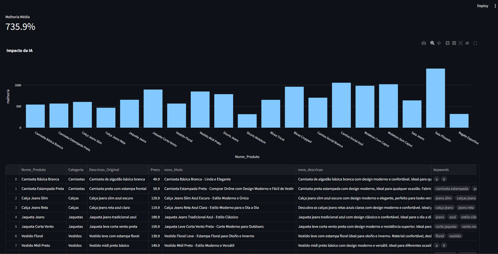
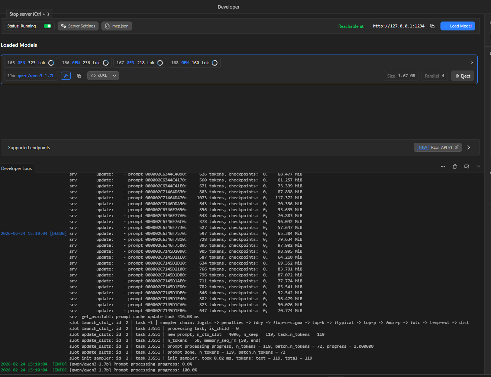
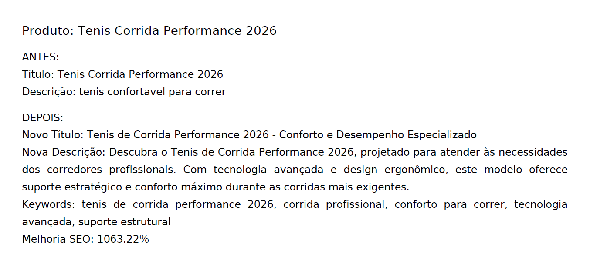

        Otimizador SEO Assíncrono com IA Local

Sistema de otimização em lote para catálogos de produtos utilizando:

- Modelo de Linguagem Local (compatível com LM Studio)

- Arquitetura Assíncrona (asyncio + aiohttp)

- Dashboard interativo (Streamlit + Plotly)

- Geração automática de relatório em PDF

- Engine de cálculo comparativo de melhoria SEO

- Visão Geral

Este projeto recebe um arquivo CSV contendo produtos e:

- Envia cada produto para um modelo de IA local

Gera:

- Novo título otimizado

- Nova descrição enriquecida

- Lista de palavras-chave estratégicas

- Calcula a melhoria estimada de SEO

- Exibe métricas em dashboard interativo

- Gera relatório comparativo em PDF

- Projetado para processamento em lote com alta eficiência.

         Interface da Aplicação

  

---

         Arquitetura

  

        Arquitetura do Sistema

CSV de Entrada ↓

Fila Assíncrona Controlada (Semaphore) ↓

API do Modelo Local (LM Studio) ↓

Limpeza e Validação de JSON ↓

Cálculo de Score SEO ↓

Dashboard + Geração de PDF

        Relatório

  

    Arquitetura Assíncrona

O sistema utiliza:

*asyncio.Semaphore(MAX_CONCORRENCIA)*

Objetivos:

- Evitar sobrecarga do servidor local

- Controlar paralelismo

- Maximizar throughput

- Reduzir tempo total de processamento

- Diferente de uma abordagem síncrona, o processamento assíncrono permite que múltiplas requisições sejam feitas simultaneamente, aumentando drasticamente a eficiência em lotes grandes.

        Metodologia de Cálculo de Melhoria SEO

Fórmula atual:

*score_antigo = len(descricao_original) / 2*
*score_novo = len(nova_descricao) / 1.5*
*melhoria = ((score_novo - score_antigo) / score_antigo) * 100*

Critérios considerados:

- Expansão de conteúdo

- Aumento de densidade semântica

- Potencial aumento de palavras-chave

        Funcionalidades do Dashboard

- Métrica de melhoria média

- Gráfico de impacto por produto

- Visualização tabular dos resultados

- Download automático de relatório em PDF

        Relatório PDF Gerado

O sistema gera um relatório contendo:

- Comparação Antes vs Depois

- Título original e otimizado

- Descrição original e otimizada

- Lista de palavras-chave

- Percentual de melhoria SEO

- Compatível com Unicode via fonte DejaVu.

        Tecnologias Utilizadas

- Python 3.10+

- Streamlit

- asyncio

- aiohttp

- Pandas

- Plotly

- FPDF

        Compatibilidade com Modelos

Compatível com APIs no padrão:

*/v1/chat/completions*

Testado com:

- LM Studio

- Modelos locais LLaMA

- Outros servidores OpenAI-compatible

        Como Executar
- 1️⃣ Clonar repositório
- git clone 
cd otimizador-seo-assincrono-ia
- 2️⃣ Instalar dependências
pip install -r requirements.txt
- 3️⃣ Iniciar servidor do modelo local

Certifique-se de que o LM Studio esteja rodando em:

http://localhost:1234
- 4️⃣ Executar aplicação
streamlit run app/main.py

         Considerações de Performance

- Limite configurável de concorrência

- Reutilização de sessão HTTP

- Tratamento de falhas em JSON retornado pelo modelo

- Estrutura preparada para expansão com cache

        Diferenciais Técnicos

✔ Arquitetura modular
✔ Processamento paralelo controlado
✔ Separação clara de responsabilidades
✔ Integração com IA local
✔ Geração automática de relatórios
✔ Projeto escalável

